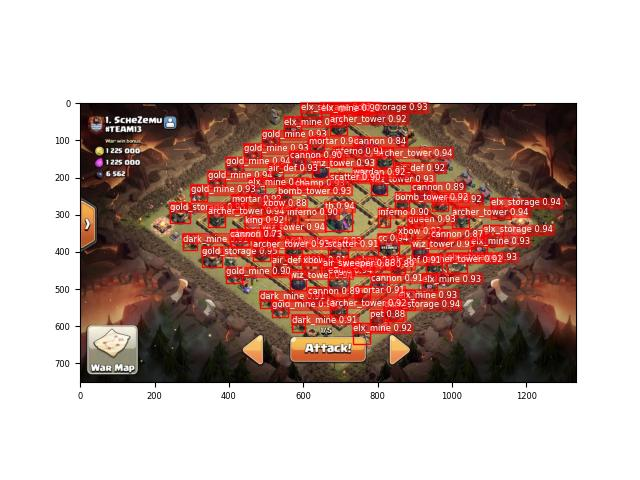
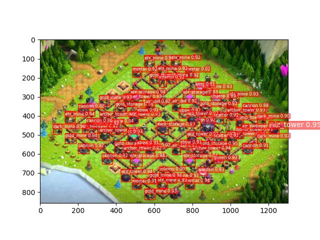

# Clash of Clans CoreML Object Detection 🕵️

This project is an object detection model for Clash of Clans, a popular mobile strategy game. The model can identify and locate various in-game buildings, defenses, and heroes. The project uses Core ML, an Apple framework for machine learning, to predict and visualize the identified objects in a given image.

Also: 90% of this readme was generated by GPT 😅

## Features
- Detection of 26 different in-game objects
- Adjustable Intersection over Union (IoU) and confidence thresholds
- Visualization of detected objects with bounding boxes and labels
- Input and output folder options for batch processing

## Dependencies
- coremltools
- numpy
- OpenCV
- Pillow
- Matplotlib

## Model

The [model file](/models/best.mlmodel) for this example is located in the `/models` folder.

## Installation
1. Clone the repository:
```bash
git clone https://github.com/BurntBaseTeam/coreml-yolov5-clash-of-clans.git
```

2. Install the required packages:
```bash
pip install -r requirements.txt
```

## Usage

Use in the command line:

```
python detect.py --input=inputs --output=output --iou_threshold=0.6 --confidence_threshold=0.6
```

To use the object detector, create an instance of the `ObjectDetector` class, specifying the input and output folders, the IoU threshold, and the confidence threshold.

```python
detector = ObjectDetector(input_folder="input_images", output_folder="output_results", iou_threshold=0.6, confidence_threshold=0.6)
```


To process a single image, use the predict method, providing the path to the input image:

```python
result_path = detector.predict("path/to/input/image.jpg")
```

To process multiple images at once, use the predictMany method, providing the path to the input folder:

```python
detector.predictMany("path/to/input/folder")
```

The results will be saved as text files in the specified output folder, and the images with detected objects will be displayed using the visualize method.

## Example
```python
from object_detector import ObjectDetector

detector = ObjectDetector(input_folder="input_images", output_folder="output_results", iou_threshold=0.6, confidence_threshold=0.6)

# Process a single image
result_path = detector.predict("path/to/input/image.jpg")

# Process multiple images
detector.predictMany("path/to/input/folder")
```

## Results
The output text files contain the detected objects' label index, coordinates, and confidence score. The REAL_LABELS dictionary in the ObjectDetector class maps the label index to the corresponding in-game object name.

The visualization of detected objects will display the input image with bounding boxes around the detected objects, along with their corresponding labels.






## License
This project is licensed under the MIT License. See the LICENSE file for details.